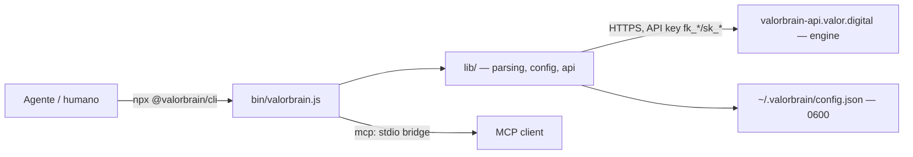

# Arquitetura — @valorbrain/cli

CLI zero-dependência que dá aos agentes (e humanos) acesso direto ao
ValorBrain hospedado. Node >= 18, sem build.

## Visão

## Contêineres

| Caminho | Papel |
|---|---|
| `bin/valorbrain.js` | Entrada única; roteia subcomandos |
| `lib/cmd-*.js` | Um módulo por comando (`init`, `add`/`search`/`list`, `status`) |
| `lib/api.js` | Cliente REST do engine (toda I/O de rede passa aqui) |
| `lib/config.js` | Lê/grava `~/.valorbrain/config.json` (chmod 0600; nunca loga a key) |
| `lib/detect.js` | Sugere `--agent-caller` do ambiente; **nunca infere** — declaração é do agente |
| `lib/mcp-proxy.js` | Ponte stdio→HTTP para clientes MCP (`mcp --token vbm_…`) |
| `packages/connect` | Pacote auxiliar de onboarding |

## Decisões estruturais

- **Zero dependências** e saída `--json` em todo comando: o cliente é um
  agente de IA (ver `docs/adr/`). Toda superfície é machine-readable por padrão.
- O CLI nunca guarda estado no servidor além da key; identidade de agente é
  self-declared (`identify`), idempotente.

Regras de contribuição: [`CONTRIBUTING.md`](CONTRIBUTING.md) · padrões: [`/www/valorbrain-platform/STANDARDS.md`](/www/valorbrain-platform/STANDARDS.md).
